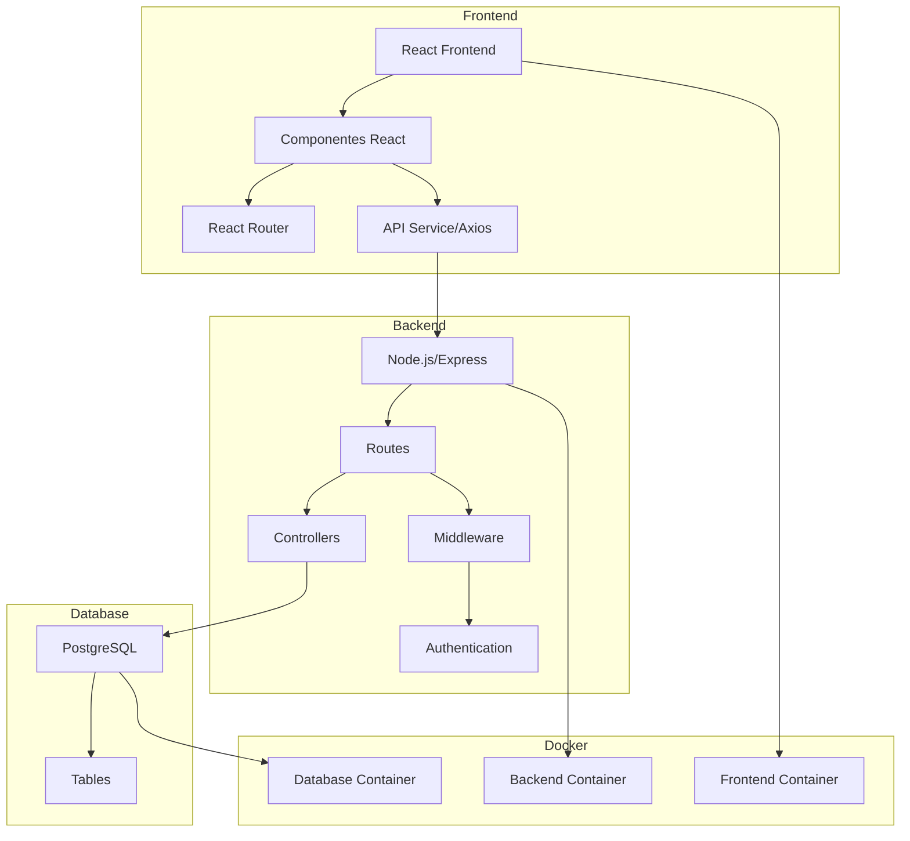

```mermaid

graph TD
    subgraph Frontend
        React[React Frontend]
        Components[Componentes React]
        Routes[React Router]
        API[API Service/Axios]
    end

    subgraph Backend
        Node[Node.js/Express]
        Routes_BE[Routes]
        Controllers[Controllers]
        Middleware[Middleware]
        Auth[Authentication]
    end

    subgraph Database
        PG[PostgreSQL]
        Tables[Tables]
    end

    subgraph Docker
        Frontend_Container[Frontend Container]
        Backend_Container[Backend Container]
        DB_Container[Database Container]
    end

    React --> Components
    Components --> Routes
    Components --> API
    API --> Node
    Node --> Routes_BE
    Routes_BE --> Controllers
    Routes_BE --> Middleware
    Middleware --> Auth
    Controllers --> PG
    PG --> Tables

    React --> Frontend_Container
    Node --> Backend_Container
    PG --> DB_Container

```