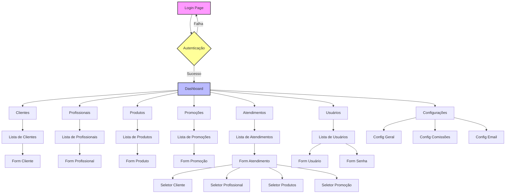

```mermaid
graph TD
    Login[Login Page] --> Auth{Autenticação}
    Auth -->|Sucesso| Dashboard[Dashboard]
    Auth -->|Falha| Login

    Dashboard --> Clientes[Clientes]
    Dashboard --> Profissionais[Profissionais]
    Dashboard --> Produtos[Produtos]
    Dashboard --> Promocoes[Promoções]
    Dashboard --> Atendimentos[Atendimentos]
    Dashboard --> Usuarios[Usuários]
    Dashboard --> Configuracoes[Configurações]

    Clientes --> ListaClientes[Lista de Clientes]
    ListaClientes --> FormCliente[Form Cliente]

    Profissionais --> ListaProfissionais[Lista de Profissionais]
    ListaProfissionais --> FormProfissional[Form Profissional]

    Produtos --> ListaProdutos[Lista de Produtos]
    ListaProdutos --> FormProduto[Form Produto]

    Promocoes --> ListaPromocoes[Lista de Promoções]
    ListaPromocoes --> FormPromocao[Form Promoção]

    Atendimentos --> ListaAtendimentos[Lista de Atendimentos]
    ListaAtendimentos --> FormAtendimento[Form Atendimento]
    FormAtendimento --> SeletorCliente[Seletor Cliente]
    FormAtendimento --> SeletorProfissional[Seletor Profissional]
    FormAtendimento --> SeletorProdutos[Seletor Produtos]
    FormAtendimento --> SeletorPromocao[Seletor Promoção]

    Usuarios --> ListaUsuarios[Lista de Usuários]
    ListaUsuarios --> FormUsuario[Form Usuário]
    ListaUsuarios --> FormSenha[Form Senha]

    Configuracoes --> ConfigGeral[Config Geral]
    Configuracoes --> ConfigComissoes[Config Comissões]
    Configuracoes --> ConfigEmail[Config Email]

    style Login fill:#f9f,stroke:#333,stroke-width:2px
    style Dashboard fill:#bbf,stroke:#333,stroke-width:2px
    style Auth fill:#ff9,stroke:#333,stroke-width:2px
```
